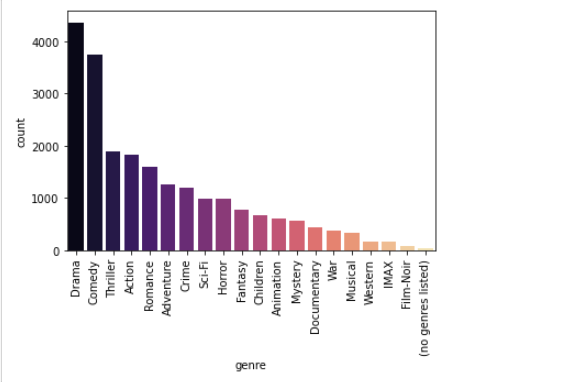

<<<<<<< HEAD
# Movie_Lens_Recommendation_System
=======
# MOVIE RECOMMENDATION SYSTEM PROJECT

## Introduction

“What movie should I watch this evening?”
Have you ever had to answer this question at least once when you came home from work? As for me—yes, and more than once.

This project aims to build a movie recommendation system by analyzing patterns in how users rate different movies, then suggesting the top 5 movies that a user is most likely to enjoy therefore increasing engagement for streaming platforms.

## Business Problem
Irrelevant movie recommendations could lead to lower watch times and users disengaging from streaming platforms.

The aim is to implement a recommendation system that will improve user satisfaction by making relevant recommendations to users leading to high watch times and customer retention.

## Project Objectives
* Create a movie recommendation system.
* Predict the rating that a user would give to a movie that he has not yet rated.
* Minimize the difference between predicted and actual rating (RMSE and MAE).

## Data Overview
This dataset utilizes information from IMDb and TMDb and describes 5-star rating and free-text tagging activity from MovieLens, a movie recommendation service. It contains 100,836 ratings and 3,683 tag applications across 9742 movies.
Movielens

## Exploratory Data Analysis

### 1. Distribution of User Ratings Count

We can see that most users rate very few movies, and few users rate many movies.

This shows that the dataset has a lot of users with little interaction.

### 2. Distribution of Movie Rating Counts

From this plot, it is evident that, very many movies have few ratings while few movies have many ratings.

### 3. Ratings Distribution

Most movies recieve a rating of 4.0 followed by 3.0. 

It is possible that users are generous with their ratings, giving a 3 if they don't really like a movie, 4 if the movie was alright and 5 if they really enjoyed the movie.

### 4. Top 10 Most Rated Movies

This graph shows the top 10 most rated movies with Braveheart at the top.

### 5. Movie Genre Frequency

Drama has the highest ratings followed by comedy while film-Noir has the least count of ratings.

### 6. Average Rating per Genre

Film-Noir, War, and Documentary have the highest average ratings although they appear least frequently in the previous graph.
This implies that these genres have niche audiences, who enjoy these movies and rate them highly.

## Recommendation Models

### Collaborative Filtering (SVD)

This was used to recommend movies based on user behaviour.

### Content-Based Filtering
This was used to compute the similarity between movies based on their genres. It allows us to recommend movies that share similar genre characteristics.

### Hybrid Recommendation System
This was used to improve recommendation quality, CF (SVD) is blended with CBF (genre similarity). 
This approach balances personalized predictions with genre- based similarities, helping address the cold start problem for new users.

## Model Comparison

**SVD Performance**: SVD consistently has a lower RMSE and MAE compared to the Hybrid system. This suggests that, in this particular evaluation, SVD is making more accurate predictions than the Hybrid approach.

**Hybrid Performance**: The Hybrid system shows significantly higher RMSE and MAE. This indicates that its predictions are further away from the actual ratings than those of SVD.

The Hybrid Model appears to be biased negatively but appears to be more consistent and has lower error variance. Since the goal is to have errors closer to zero on average, the SVD model is more preferable but its spread suggests that it's inconsistent.

## Conclusion

In this Analysis, we evaluated the performance of different models for predicting movie ratings; SVD and a Hybrid model. Though the hybrid model was more consistent, the goal was to have errors close to zero on average which is why the SVD model is more preferable.

## Next Steps
Model Tuning: Further hyperparameter tuning for both models.

Hybrid model enhancements: Advanced hybridization techniques such as weighted blending or even adding more CBF should be considered to help reduce hybrid model's bias and improve performance.

Cold-Start Problem: In the analysis, we attempted to solve the problem using global genre preference. Popularity-Based Recommendations should also be considered to try and address the problem.
>>>>>>> 394a5ea (Removed embedded Git repository)
